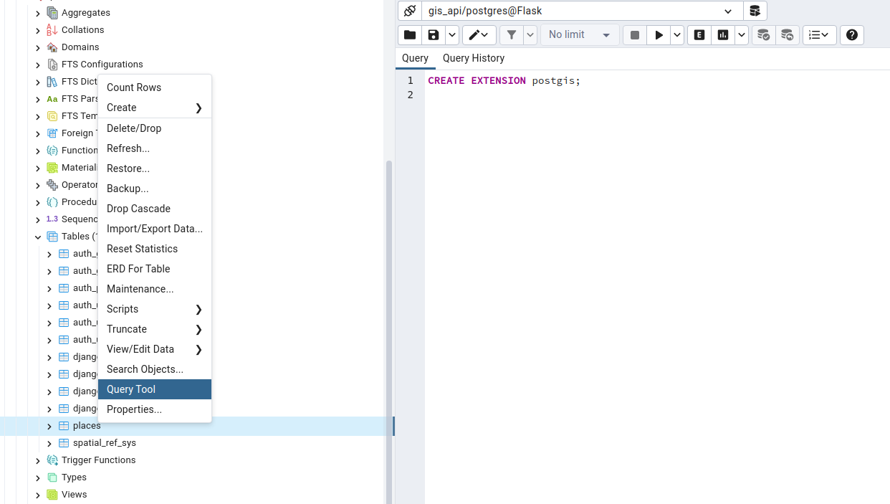
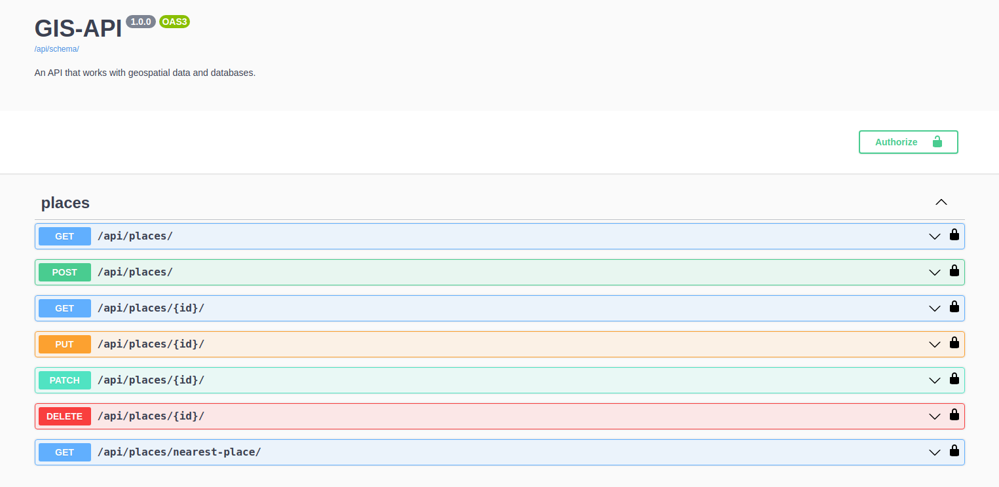

## GIS-API.

### Description.

An API that works with geospatial data and databases.

### Installation.

**NOTE:** Python3 must be already installed.

```shell
git clone https://github.com/Vasyl-Poremchuk/gis-api
cd gis_api
python -m venv venv
venv\Scripts\activate (Windows) or sourse venv/bib/activate (Linux or macOS)
pip install -r requirements.txt
```

**NOTE:** Before running the application, you must create an **.env** file and fill it using the  template in the **.env.sample** file.

### Running the application on the local machine.

Apply the migrations by running the command below:

```shell
python manage.py migrate
```

Start the web server using the command below:

```shell
python manage.py runserver
```

**NOTE:** Before you can run and apply migrations, you must create a **PostgreSQL** database. Also, if you want to add the **PostGIS** extension to your table (in our case **places**), run the following command on the **Query Tool** tab:


### Swagger documentation.

The GIS-API has several endpoints available, which you can check out in the swagger documentation (use **http://127.0.0.1:8000/api/doc/swagger/**)

